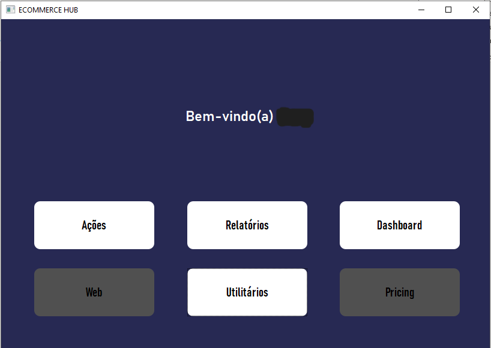

# Ecommerce Hub

#### Português
O projeto consiste em um software de desktop que reúne as principais ferramentas para a administração de um Ecommerce.
Enquanto estava estagiando em uma empresa de vendas pela internet, percebi que algumas informações não estavam sendo bem utilizadas e alguns processos eram lentos. Decidi então fazer um programa em python que tivesse algumas funcionalidades importantes para a análise de dados e também automação de processos. Assim surgiu o Ecommerce Hub, meu primeiro projeto para uma empresa. Modifiquei todos os dados que estavam relacionados à empresa e refiz algumas funções para adaptar o programa à um número maior de cenários.

No estágio inicial do projeto, o mesmo deveria ter uma quantidade maior de funções, como mostra a imagem abaixo. A maioria foi retirada pois eram funções feitas especificamente para a empresa.

#### English
The project consists of a desktop software that brings together the main tools for managing an Ecommerce business. While interning at an online sales company, I noticed that some information was not being well utilized, and some processes were slow. I decided to create a Python program with important features for data analysis and process automation. That's how the Ecommerce Hub was born, my first project for a company. I modified all the company-related data and redesigned some functions to adapt the program to a wider range of scenarios.

In the initial stage of the project, it was supposed to have a greater number of functions, as shown in the image below. Most were removed because they were specifically tailored to the company.

#### Português
O programa conta com uma tela de login e cadastro para acesso gerenciado do usuário. As senhas informadas são criptografadas antes de serem armazenadas, garantindo uma maior segurança.

#### English
The program features a login and registration screen for managed user access. The passwords entered are encrypted before being stored, ensuring higher security.

#### Português
Após feito o cadastro/login, o programa irá para a tela principal, onde temos as duas funcionalidades, o Dashboard e os Utilitários.

#### English
After registration/login, the program navigates to the main screen, where we have two functionalities: the Dashboard and the Utilities.

# Ecommerce Dashboard
#### Português
No Dashboard é onde temos as informações principais das vendas da empresa em todos os Marketplaces. No dashboard geral nós temos a visão de vendas dos marketplaces de acordo com a data que for escolhida no programa. Também podemos vizualisar o total de vendas do mês, a meta do mês e uma barra mostrando o quanto da meta já foi alcançada.

#### English
The Dashboard provides the main information about the company's sales across all Marketplaces. In the general dashboard, we have a view of marketplace sales according to the chosen date in the program. We can also view the total sales for the month, the monthly target, and a progress bar showing how much of the target has been achieved.

#### Português
Já o Dashboard Individual nos mostra informações específicas de cada Marketplace separadamente, além das informações mostradas no dashboard geral, temos também um gráfico mostrando as vendas dos dias selecionados para comparação. No lado direito temos as informações dos três produtos mais vendidos, das três marcas com maior número de vendas e os estados que mais vendem.

#### English
The Individual Dashboard shows specific information for each Marketplace separately. In addition to the information displayed in the general dashboard, we have a graph showing the sales for the selected days for comparison. On the right side, we have information about the top three selling products, the top three brands by sales volume, and the states with the highest sales.

#### Português
Também podemos aumentar o tamanho do gráfico, reduzindo as outras partes para termos uma visualização melhor.

#### English
We can also increase the size of the graph, reducing the other sections for a better visualization.

#### Português
E podemos também reduzir e aumentar a parte que quisermos como quisermos no programa de acordo com a preferência do usuário.

#### English
And we can also resize and adjust any part of the program according to the user's preference.

# Consulta SKU/Lookup SKU
#### Português
Clicando no botão "utilitários" na tela principal o programa é levado para a função que exibe as informações do produto por seu ID.
Colocando o ID(SKU) na barra de pesquisa e clicando no botão "Buscar SKU", o programa pesquisa na base de dados e retorna na tela as informações disponibilizadas do produto, como nome do produto, marca, categoria, tamanho, peso, entre outras.

#### English
Clicking on the "utilities" button on the main screen takes the program to the function that displays product information by its ID. By entering the ID (SKU) in the search bar and clicking the "Search SKU" button, the program searches the database and displays the available information about the product on the screen, such as product name, brand, category, size, weight, and others.

#### Português
Essas são as funções disponibilizadas no programa até o momento, estou trabalhando em outras funcionalidades e em fazer com que o programa se torne escalável. Uma das ideias é utilizar a inteligência artificial para analisar os dados disponíveis e ajudar na tomada de decisões da empresa.

#### English
These are the functions available in the program at the moment. I'm working on adding more features and making the program scalable. One of the ideas is to utilize artificial intelligence to analyze the available data and assist in the company's decision-making process.

# Conclusão
#### Português
Foi muito importante para meu desenvolvimento criar esse programa sozinho do zero e conseguir ajudar a empresa a atingir melhores resultados. Durante meu período de estágio também fiz alguns programas de automação de tarefas que diminuiram o tempo de realização das tarefas em menos da metade, como também funções para análise de dados e web scraping. O "Ecommerce Hub" me fez querer aprender mais sobre a área e me desenvolver para conseguir melhores resultados dentro da área de tecnologia.
Quem tiver interesse em ajudar com o projeto pode entrar em contato.
Agradeço pela atenção!

#### English
Creating this program from scratch on my own was crucial for my development and for aiding the company in achieving better outcomes. During my internship, I also developed some task automation programs that reduced task completion time by more than half, along with functions for data analysis and web scraping. The "Ecommerce Hub" has motivated me to delve deeper into this field and further my development to achieve better results in the technology sector. If anyone is interested in contributing to the project, please feel free to get in touch. Thank you for your attention!
